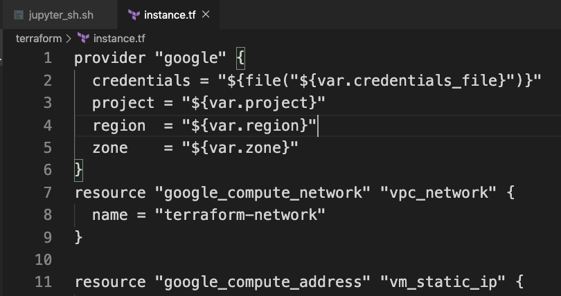
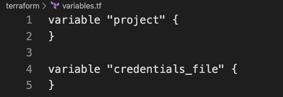
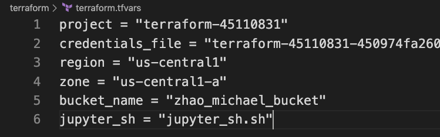
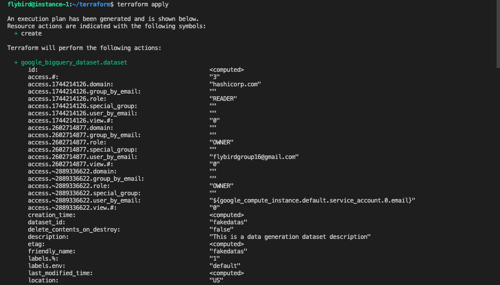
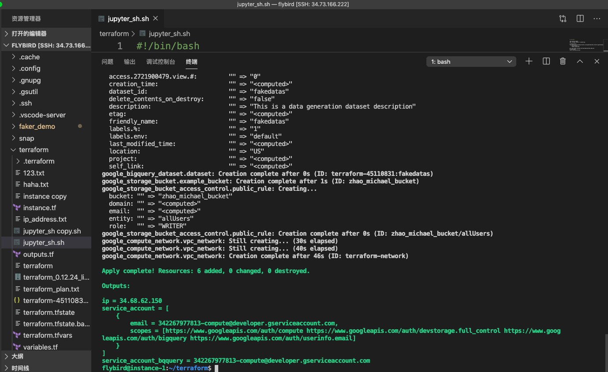
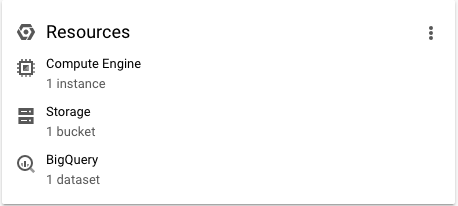
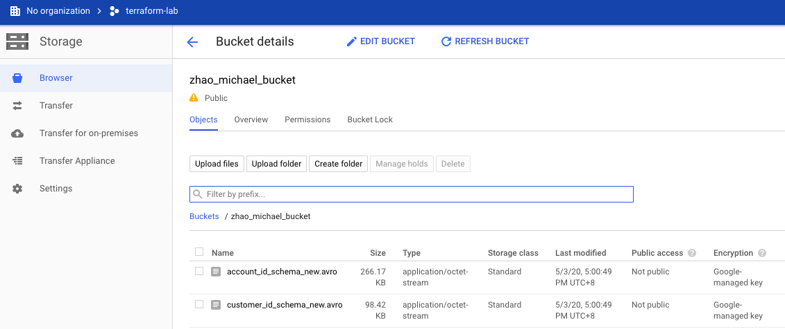
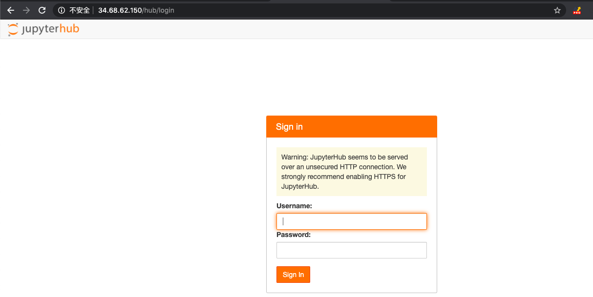

# Terraform for GCP Bigquery Jupyter Storage
 
 Use Terraform to create Bigquery's dataset,table,jupyter hub,storage bucket, a vm instance
 
## Step 1: use vscode to connect your server.
 
## Step 2: We will install terraform.
if you don't know how to install terraform, please follow the link to [install terraform](https://learn.hashicorp.com/terraform/gcp/install), after install terraform, please verify the installation by typing "terraform" in the GCP shell or your server.
 
 
## Step 3: Change Infrastructure
there are 5 key files:

1. instance.tf---an important file to build resource like google_compute_instance, google_storage_bucket.


2. variables.tf--a file to show variables



3. terraform.tfvars-- set values or params for the variables



4. outputs.tf--output some variables or params we think its important like vm-static-ip
5. jupyter_sh.sh--its a meta_startup_script for creating vm instance. this file will help us to build jupyter_hub,git clone my fake_data_genertor project, install python package, generate data, copy data to Google Storage bucket and build bigquery's dataset and tables based on the data from Storage bucket.

#### Suppose that you want to change variables like your GCP project's name, you can go to variables.tf to set your variable and go to terraform.tfvars to set your values.


## Step 4: Quick Start. 

Build the infrastructure by Terraform. git clone my project and switch to the project directory. then, if you just want to start quickly, please type the command lines step by step:

 1. terraform init
 2. terraform plan
 3. terraform apply
 4. if you want to delete the infrastructure, please type "terraform destroy" ( make sure your delete your dataset first)
 

 

## Check your Infrustructure

1. Compute Engine, Storage, Bigquery
 
2. Data was saved in Storage bucket
 
3. Jupyter hub was installed ( it may take 10-20 minutes to be available)
 

## login into your VM instance

you can use gcloud, gsutil,bq command lines to process the datas.

for example:

```
bq load --source_format=AVRO fakedatas.customer "gs://zhao_michael_bucket/customer_id_schema_new.avro"
bq load --source_format=AVRO fakedatas.account "gs://zhao_michael_bucket/account_id_schema_new.avro"
```

for more command lines for Storage Bucket and Big Query, please see the files from the project ([bq_command_lines.md](./bq_command_lines.md) and [gsutil_command_lines.md](./gsutil_command_lines.md)

# To_do

Build Bigquery client to query by Python
